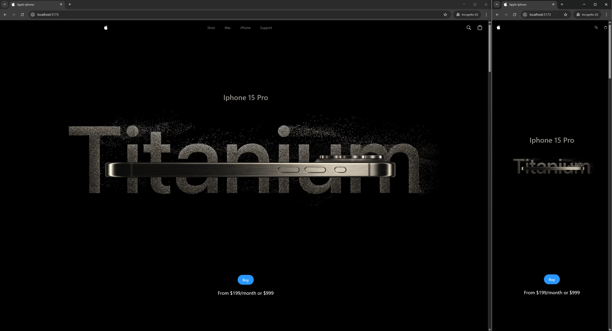
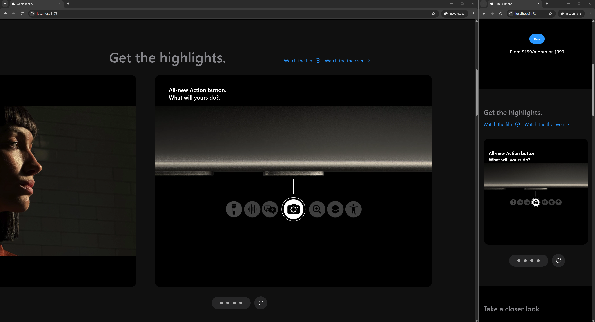
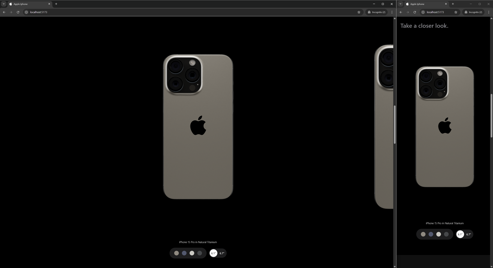
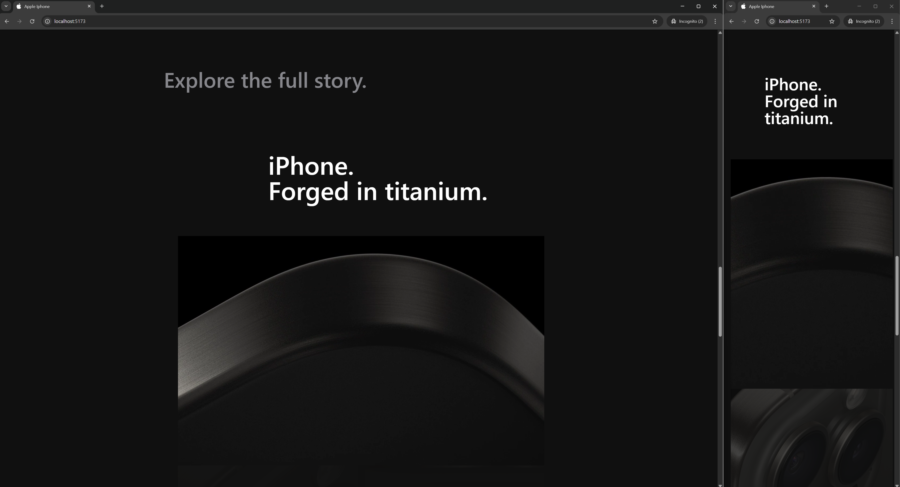
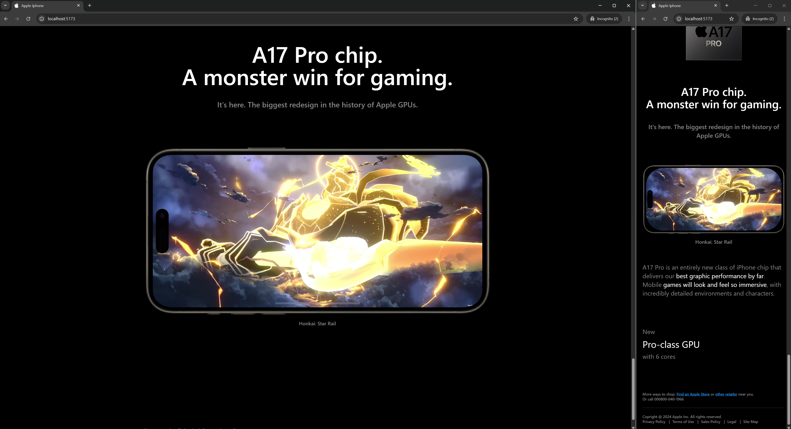

# 📱 iPhone 15 Pro Clone Webpage

A responsive and interactive clone of the iPhone 15 Pro product page, inspired by Apple's iconic design. Built step-by-step with guidance from the **JavaScript Mastery** tutorial, this project showcases modern web development tools and techniques to deliver a visually engaging and immersive experience.

## 🚀 Features

- 🌀 **3D iPhone 15 Pro Model** — Rotate and explore the phone from every angle.
- 🎨 **Dynamic Color Options** — Switch between multiple iPhone 15 Pro color variants.
- 📏 **Size Variants** — Preview the phone in different sizes.
- 💫 **Smooth Animations** — Beautiful GSAP-powered transitions and effects.
- 📱 **Responsive Layout** — Seamlessly adapts to all screen sizes.

## 🛠️ Built With

- [React](https://reactjs.org/)
- [Tailwind CSS](https://tailwindcss.com/)
- [Three.js](https://threejs.org/)
- [React Three Fiber](https://docs.pmnd.rs/react-three-fiber)
- [React Drei](https://github.com/pmndrs/drei)
- [GSAP (GreenSock Animation Platform)](https://greensock.com/gsap/)
- [Vite](https://vitejs.dev/) – for blazing-fast development

## 📸 Preview

### 🧊 Hero Section – iPhone 15 Pro Introduction
*An elegant entrance featuring the iPhone 15 Pro with smooth animation and clean visuals.*

---

### ✨ Highlights – New Features Showcase
*Overview of the key innovations and improvements in the new iPhone 15 Pro.*

---

### 🔄 3D Model – Interactive Product Exploration
*Users can explore a fully interactive 3D model of the iPhone 15 Pro in real time.*

---

### 🛡️ Materials – Premium Build Introduction
*Highlights the new titanium material and structural enhancements in the iPhone's design.*

---

### ⚡ Chip – Powering the Experience
*Introducing the new chip inside the iPhone 15 Pro, showcasing performance and efficiency.*

